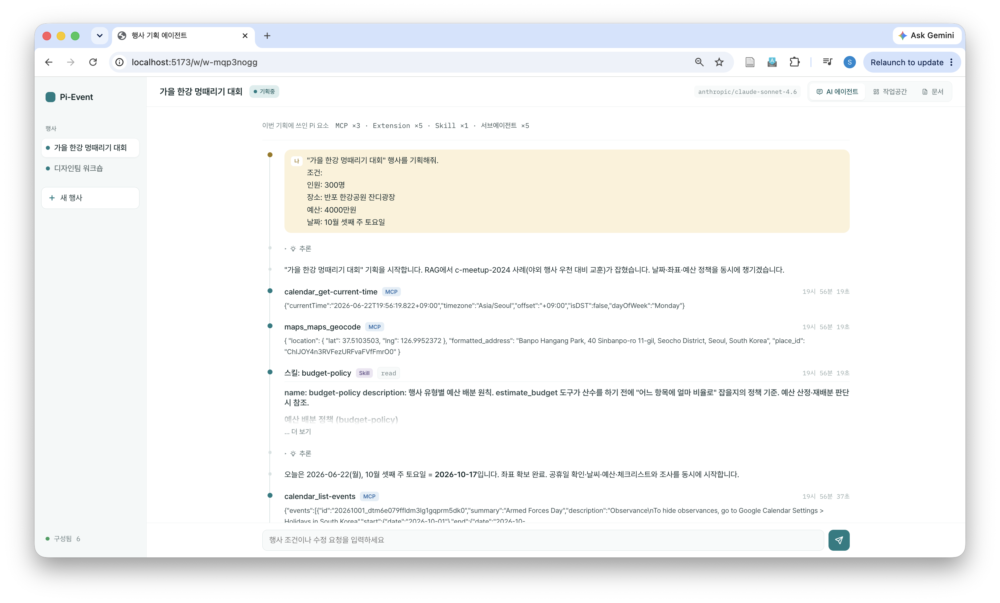
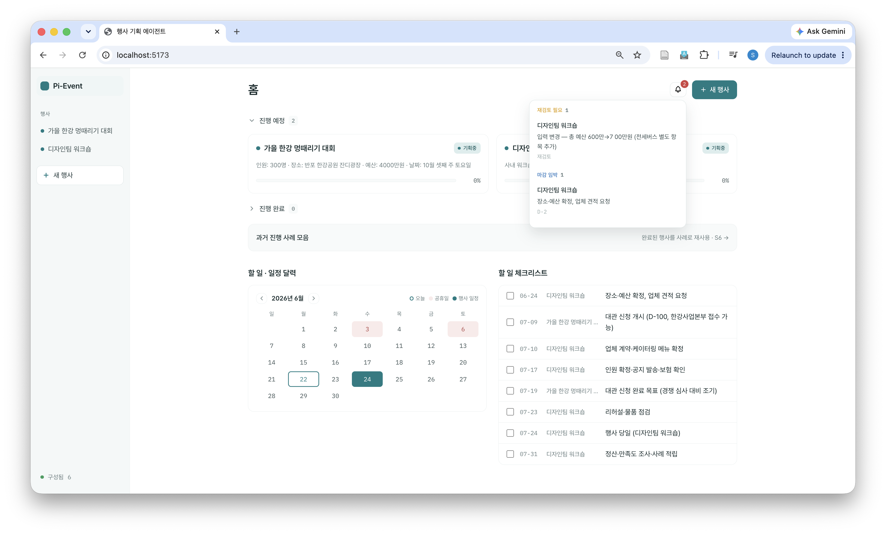
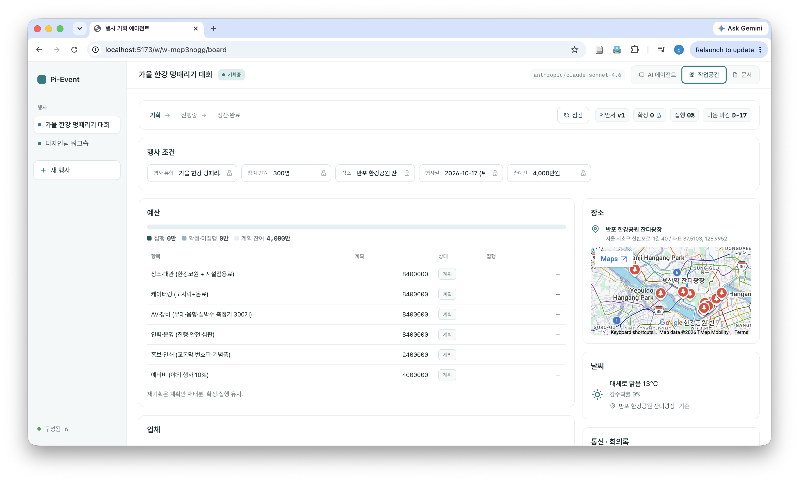
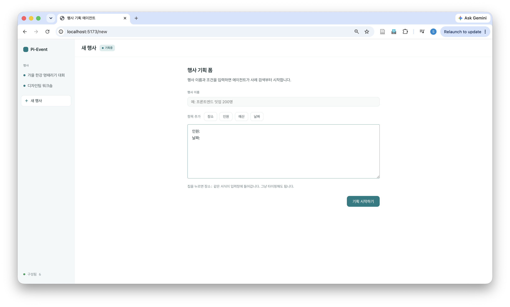
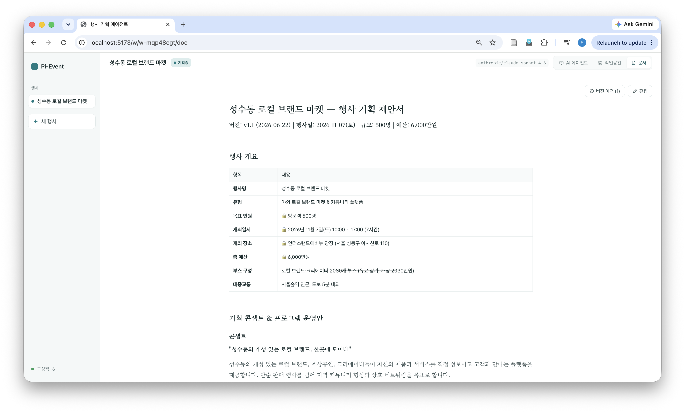
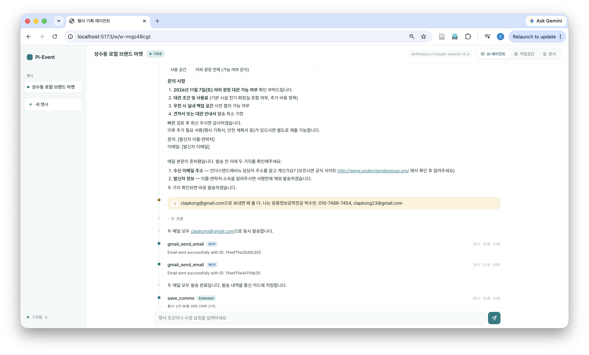
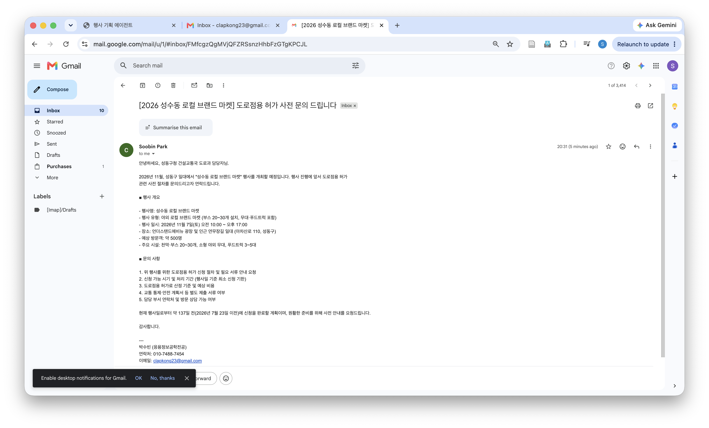

# pi-event-agent

행사 준비를 처음부터 끝까지 대신 수행하는 AI 에이전트 웹 서비스다.

사용자가 행사 조건(예: "사내 워크숍, 200명, 예산 500만 원, 9월 셋째 주, 야외 선호")을 입력하면, 에이전트가 도구를 직접 실행해 과거 행사 검색, 장소·업체 조사, 예산 배분, 제안서 작성, 업체 메일 발송, 정산까지 하나의 흐름으로 처리한다. 끝난 행사는 사례로 저장해 두고, 다음 행사를 기획할 때 과거의 업체·예산·교훈을 다시 활용한다.

방법을 설명하는 챗봇이 아니라 검색·지도·메일·캘린더를 실제로 실행해 작업을 대신한다. 다만 돈이 들거나 외부로 나가는 결정(예산 확정, 업체 계약, 메일 발송)은 반드시 사람이 확인한 뒤에 진행한다.

이 프로젝트는 과제에 제시된 20가지 시나리오에 포함되지 않은 '행사 기획 도우미'를 별도 시나리오로 선정하여, 수업에서 사전 승인을 받았다.

## 목차

1. [프로젝트 소개](#1-프로젝트-소개)
2. [주요 기능](#2-주요-기능)
3. [Pi / Skill / MCP / Pi Extension 활용](#3-pi--skill--mcp--pi-extension-활용)
4. [사용한 기술 스택](#4-사용한-기술-스택)
5. [실행 화면](#5-실행-화면)
6. [설치 방법](#6-설치-방법)
7. [실행 방법](#7-실행-방법)

## 1. 프로젝트 소개

### 해결하려는 문제

행사 준비는 장소 조사, 예산 계산, 업체 비교, 문서 작성, 일정 관리가 뒤섞인 작업이며, 매번 비슷한 일을 처음부터 다시 한다. 또한 지난 행사에서 좋았던 업체나 예산 배분을 다음 행사에서 활용하지 못하고 담당자의 기억에 의존하는 경우가 많다.

### 대상 사용자

사내 워크숍, 채용설명회, 밋업, 세미나, 동아리 행사처럼 소규모 행사를 직접 챙기는 담당자를 위한 서비스다. 초안과 조사는 AI에게 맡기되 예산·업체 같은 중요한 결정은 본인이 직접 통제하고 싶은 사용자를 가정했다.

### 일반 챗봇과의 차이

| 항목 | 일반 챗봇(ChatGPT 등) | pi-event-agent |
|---|---|---|
| 일하는 방식 | 말로 설명 | 도구를 직접 실행(검색·지도·메일·캘린더) |
| 범위 | 한 번의 답변 | 조사 → 예산 → 제안서 → 발송까지 end-to-end |
| 과거 활용 | 사용자의 지난 행사를 모름 | 과거 사례를 검색·인용해 재사용 |
| 통제 | 전부 AI가 처리 | 확정·발송은 사람 승인을 거침 |

설계 원칙은 "행사 한 건 = 하나의 작업 공간 = 하나의 AI 세션 = 하나의 결과 제안서"다. 작업 공간 하나가 곧 하나의 AI 세션이고, 그 안에서 조건 입력부터 최종 제안서까지 한 흐름으로 진행된다.

## 2. 주요 기능

- 작업 로그: AI가 지금 무엇을 조사하고 어떤 도구를 쓰는지 화면에 한 줄씩 표시한다. 각 단계에 어떤 종류의 기능(외부 도구 MCP, 자체 도구 Extension, 매뉴얼 Skill)을 썼는지 함께 표시된다.
- 사람이 개입하는 세 지점: 실행 중 중지, AI가 선택지를 묻는 되묻기, 메일 발송·기록처럼 중요한 작업 직전의 승인 요청.
- 예산·업체 상태 관리: 예산은 계획 → 확정(잠금) → 집행 3단계, 업체는 후보 → 견적 → 확정(잠금) → 계약 4단계로 관리한다. 사람이 확정으로 잠근 값은 AI가 임의로 변경하지 못한다.
- 조건 변경 시 재기획 제안: 날씨 예보나 장소가 바뀌면 영향받는 부분에 "다시 검토 필요" 표시가 뜨고, 사람이 잠가 둔 값은 유지한 채 남은 예산 안에서 계획만 다시 구성한다.
- 제안서 작성, 수정 이력, 출처: AI가 작성한 제안서를 사람이 직접 수정할 수 있고, AI 작성본과 사람 수정본의 버전이 남는다. 본문 근거에는 출처 번호(`[1]`)가 달려, 클릭하면 어떤 과거 사례·자료에서 가져왔는지 확인할 수 있다.
- 과거 사례 재사용: 끝난 행사는 사례 파일로 저장해 두고 새 기획에서 검색·인용한다. 인용 시 어떤 행사가 해당 사례를 썼는지(`citedBy`)가 기록된다.
- 외부 도구 연동: Gmail 메일 발송(사람 승인 후), Google Calendar 일정 등록, Google Maps 장소·거리·접근성 확인, 행사일 날씨 조회.

### 처리 흐름 예시

사용자가 "사내 워크숍, 200명, 예산 500만 원, 9월 셋째 주, 야외 선호"를 입력하면 메인 에이전트가 다음을 순서대로 실행한다.

1. 과거 사례 검색: `rag_query("야외 200명 워크숍")`으로 비슷한 지난 행사를 찾는다. 있으면 참고하고, 없으면 그대로 진행한다.
2. 조사(병렬): 조사 담당 보조 에이전트(`researcher`)를 여러 개 띄워 장소 후보, 케이터링·AV 업체와 시세, 벤치마크 사례를 동시에 조사한다.
3. 날씨·일정 확인: 야외 행사이므로 `get_weather`로 9월 셋째 주 우천 확률을 확인하고, Google Calendar로 그 주의 요일·공휴일(추석 연휴 등)을 확인한다.
4. 사용자 선택 요청: 조사한 장소 후보를 `ask_user_question`으로 제시하고 사용자가 직접 고른다. 고른 장소는 확정으로 잠근다.
5. 예산 배분: `estimate_budget`으로 500만 원을 장소·케이터링·장비·운영·예비비로 나눈다. 산수는 AI가 아니라 도구가 계산한다.
6. 제안서 작성·검토: 작성 담당(`writer`)이 초안을 쓰고, 검토 담당(`critic`)이 리스크·예산 초과·누락을 점검한다. 통과할 때까지 수정한다.
7. 저장: 완성된 제안서를 `save_report`로 저장한다.
8. 업체 메일 발송: "케이터링 업체에 견적 요청 메일을 보낼까요?"라고 묻고, 사용자가 승인하면 메일 문안을 작성해 Gmail로 발송한다.
9. 운영 중 점검: 작업 공간의 '점검'을 누르거나 일정 주기마다, `secretary`가 받은 편지함에서 이 행사 관련 메일을 정리하고 `monitor`가 날씨·통신 변화를 보고 재기획이 필요한지 판단한다. 영향이 있으면 "다시 검토 필요" 배너가 뜨고, 잠근 값은 유지한 채 남은 예산만 다시 구성한다.
10. 행사 후 적립: 사용자가 "완료"로 확정하면 에이전트가 회고·만족도를 받고(`satisfaction-survey` 스킬), 이 행사를 조건·핵심 결정·예산 실집행·교훈이 담긴 사례 파일(`cases/<id>.md`)로 정리해 `save_case`로 저장하고 `rag_index`로 검색 색인에 추가한다. 이 사례는 다음 행사 기획의 1번 단계에서 다시 검색·인용된다.

## 3. Pi / Skill / MCP / Pi Extension 활용

구성: 에이전트 6종, Skill 4개, MCP 3개, 직접 만든 Extension 1개(도구 8개 + 안전장치), 채택한 Extension 1개.

### 3.1 Pi (AI 에이전트 프레임워크)

Pi는 사용자의 요청을 받아 어떤 도구를 쓸지 판단하고 실행하는 에이전트 프레임워크다.

- 실행 방식: Pi를 `pi --mode rpc` 모드(외부 프로그램과 표준입출력으로 통신)로 백그라운드에서 실행한다. 중계 서버가 행사마다 Pi를 하나씩 띄우고, Pi가 답을 만들고 도구를 쓰는 과정을 실시간으로 웹 화면(작업 로그)에 전달한다.
- 사람 개입(human-in-the-loop): Pi의 기능으로 실행 중 중지, 선택지 되묻기, 작업 직전 승인 게이트를 구현했다.
- 보조 에이전트 6종: 메인 에이전트가 작업을 분배한다.

| 에이전트 | 역할 |
|---|---|
| 메인(Planner) | 사용자와 대화하는 본체. 조사·작성·검토를 위임하고 종합해 제안서까지 완성, 재기획 담당 |
| `researcher` | 장소·업체·시세·날씨 등 외부 조사. 여러 개를 동시에 띄워 병렬 조사 |
| `writer` | 조사 결과로 제안서 초안 작성 |
| `critic` | 초안 검토(리스크·예산 초과·누락·잠금 위반) 및 통과 여부 판정 |
| `secretary` | 운영 중 받은 메일을 읽어 회의록(사실 요약)으로 정리 |
| `monitor` | 운영 중 날씨·통신 변화를 감지해 재기획 필요 여부 판단 |

기획 단계에서는 메인이 `researcher`·`writer`·`critic`을 직접 호출하고, `writer`와 `critic`은 "초안 작성 → 검토 → 수정"을 통과할 때까지(최대 2회) 반복한다. 운영 단계에서는 작업 공간의 '점검'(수동 버튼과 주기 자동)이 `secretary`(메일 정리)와 `monitor`(변화 감지·재기획 판단)를 호출해 결과를 보드에 반영한다.

### 3.2 Skill (에이전트 업무 매뉴얼)

Skill은 에이전트가 특정 작업을 일관되게 수행하도록 돕는 절차와 리소스(템플릿·데이터·레퍼런스) 묶음이다(`.pi/skills/<이름>/SKILL.md`). 4개를 직접 작성했고, 각 스킬은 절차 문서뿐 아니라 `assets/`·`references/`에 실제 자료를 함께 담는다.

| Skill | 절차 | 함께 담긴 리소스 |
|---|---|---|
| `budget-policy` | 행사 유형별 예산 배분 비율·조정 원칙 | `assets/ratios.json`(`estimate_budget` 도구가 직접 읽는 배분 데이터). 기업 행사와 학생회 행사(새터·MT·축제/주점·체전) 유형별 표 |
| `notice-writer` | 초청·공지·업체 메일의 채널·격식별 작성법 | 메일 템플릿 8종(`assets/*.md`): 초청·리마인더·취소·감사·업체 견적요청(RFQ)·발주확인·학우 공지·학교 행정 |
| `risk-assessment` | 사전 점검 5축(안전, 인허가/보험/소방, 접근성, 비상대응, 식이) | `assets/checklist-template.json`, `references/`(인허가·보험 상세, 학생회 행사 위험). 과거 사고는 `rag_query`로 참조 |
| `satisfaction-survey` | 사후 만족도 설문 설계·분석(NPS·감정) | `assets/survey-template.json`(권장 문항 세트) |

단순 지시가 아니라 도구가 읽는 데이터(`ratios.json`), 메일 템플릿, 점검 레퍼런스까지 포함한다. 에이전트는 작업을 만나면 해당 `SKILL.md`를 읽고 필요한 리소스를 불러와 사용한다.

### 3.3 MCP (외부 서비스 연결)

MCP(Model Context Protocol)는 외부 서비스를 에이전트에 연결하는 표준 규격이다. 3개를 연결했다(`.pi/mcp.json`).

| 도구 | 서버 | 사용 예 |
|---|---|---|
| Gmail | `@gongrzhe/server-gmail-autoauth-mcp` | 업체 견적 요청 메일 발송(승인 후), 회신 확인 |
| Google Calendar | `@cocal/google-calendar-mcp` | "9월 15일이 무슨 요일인지, 추석 연휴와 겹치는지" 확인, 마일스톤 캘린더 등록 |
| Google Maps | `@modelcontextprotocol/server-google-maps` | "성수동 이벤트홀 주변 주차장·카페" 검색, 역에서 장소까지 이동 거리·접근성 확인 |

공식 Google Workspace MCP는 기업용 미리보기 프로그램에 승인된 계정만 쓸 수 있어 일반/학생 계정으로는 작동하지 않는다. 그래서 표준 Google API를 쓰는 공개 커뮤니티 서버를 채택해 개인 계정으로 바로 쓰도록 했다. 연결은 `pi-mcp-adapter` 패키지가 담당하며, MCP는 필요할 때만 연결되므로 이 설정 없이도 앱은 실행된다(외부 도구만 비활성화). 설치 방법은 [6. 설치 방법](#6-설치-방법) 참고.

### 3.4 Pi Extension (직접 만든 기능 확장)

Extension은 Pi에 새 도구를 코드로 추가하는 방법이다. `event-tools` Extension을 직접 만들어 도구 8개와 안전장치를 넣었다(`.pi/extensions/event-tools.ts`).

| 도구 | 역할 |
|---|---|
| `estimate_budget` | 유형·인원·총예산을 받아 항목별로 배분(코드가 계산) |
| `build_checklist` | 행사일 기준 준비 일정(D-30/14/7/1/당일) 날짜 계산 |
| `update_state` | 화면(보드)의 예산·업체·일정 상태를 저장하는 유일한 통로 |
| `save_report` | 완성된 제안서를 파일로 저장 |
| `get_weather` | 행사일 날씨 조회(Open-Meteo) |
| `save_comms` | 정리된 통신(회의록) 저장 |
| `save_case` | 끝난 행사를 사례 파일로 적립 |
| `ask_user_question` | 사용자에게 선택지를 구조화해 되묻기 |

안전장치는 Pi의 훅(Hook)으로 구현했다. `pi.on("tool_call", …)`으로 도구 실행을 가로채, 규칙을 어기면 `{ block: true }`로 실행 자체를 막는다. 세 가지 훅이 작동한다.

- 잠금 가드: 사람이 확정한 값(예산 항목·조건)이나 계약 완료 업체를 바꾸려 하면 차단
- 집행 가드: 이미 집행된 예산을 줄이거나 되돌리려 하면 차단
- 승인 게이트: 메일 발송·사례 적립 직전, 사람 승인(`ctx.ui` 확인)이 없으면 차단

도구를 추가하는 데 그치지 않고, AI가 값을 지어내거나 임의로 발송·변경하는 것을 코드 단에서 막는다. 또한 `estimate_budget`·`build_checklist`는 비율·일정을 코드에 직접 박지 않고 데이터 파일(`ratios.json`·`checklist.json`)에서 읽어, Skill의 정책과 한 소스로 연결된다.

과거 사례 검색은 직접 만들지 않고 공개 Extension `pi-local-rag`을 채택했다. 사례 `.md` 파일들을 색인해 의미와 키워드를 결합한 하이브리드 검색으로 찾는다(별도 DB·서버 없이 로컬에서 동작).

### 3.5 Web UI

CLI가 아니라 React 웹 화면을 제공한다. 홈(전체 행사 현황), 새 행사 만들기, 에이전트 작업 로그, 작업 공간(예산·업체·일정 관리), 제안서 문서, 과거 사례로 구성된다. 작업 로그의 각 단계에 어떤 Pi 요소(MCP/Extension/Skill)를 썼는지 색으로 표시해 다섯 요소가 실제로 동작함을 보여 준다.

시스템 연결 구조는 [웹 화면(React)] ↔ [중계 서버(Node·Fastify)] ↔ [Pi 에이전트]다. 웹 화면은 브라우저에서, Pi는 컴퓨터에서 돌기 때문에 가운데 Node 서버가 행사마다 Pi를 띄우고 진행 상황을 WebSocket으로 화면에 전달한다. 데이터(예산·제안서·사례)는 별도 DB 없이 파일(.json·.md)로 저장한다.

## 4. 사용한 기술 스택

전부 TypeScript와 Node.js 기반이다.

| 구분 | 사용 기술 |
|---|---|
| 웹 화면 | React 18, Vite, React Router, react-markdown |
| 통신 | WebSocket(에이전트 진행 실시간 전달), REST(데이터 조회·편집) |
| 중계 서버 | Node.js, Fastify, @fastify/websocket |
| AI 에이전트 | Pi(`@earendil-works/pi-coding-agent`), `pi --mode rpc` 모드 |
| Pi 확장 패키지 | `@tintinweb/pi-subagents`(보조 에이전트), `pi-mcp-adapter`(MCP 연결), `pi-web-access`(웹 검색), `pi-local-rag`(사례 검색) |
| 언어 모델(LLM) | OpenRouter 경유. 메인 에이전트 `claude-sonnet-4.6`, 서브에이전트는 역할별로 `gemini-2.5-flash`(조사·통신), `claude-haiku-4.5`(작성·검토·점검) |
| 데이터 저장 | 파일 기반(.json·.md), `pi-local-rag` 내부 검색 색인(SQLite, 오프라인) |
| 외부 도구 | Gmail, Google Calendar, Google Maps(MCP), Open-Meteo(날씨) |

## 5. 실행 화면

### 에이전트 작업 로그

조건을 입력하면 에이전트가 실시간으로 조사·도구 실행을 진행하며, 각 단계에 어떤 Pi 요소를 썼는지 마커(MCP·Extension·Skill)가 달린다. 상단에 "MCP ×3 · Extension ×5 · Skill ×1 · 서브에이전트 ×5" 요약이 표시된다.



### 홈 대시보드

진행 중인 행사 타일, 알림, 일정 캘린더, 할 일 체크리스트를 한눈에 본다.



### 작업 공간

행사 한 건의 예산·장소(지도)·날씨·일정을 관리한다. 예산은 계획 → 확정 → 집행 단계로 추적된다.



### 새 행사 만들기

장소·인원·예산·날짜 조건을 입력해 기획을 시작한다.



### 제안서 문서

AI가 작성한 제안서를 사람이 직접 편집·확정하고, 버전 이력과 출처를 남긴다.



### 메일 발송(Gmail MCP)

승인을 거쳐 에이전트가 업체에 메일을 보내고(발송 로그에 메시지 ID 확인), 실제로 받은 편지함에 도착한다.





인용 드로어는 제안서의 `## 출처` 섹션을 파싱해 `[n]` 클릭 시 출처 텍스트와 사례·원문 링크를 보여 준다.

## 6. 설치 방법

준비물: Node.js(LTS 버전), Pi 설치(`npm install -g @earendil-works/pi-coding-agent`), 언어 모델용 OpenRouter API 키.

```bash
# 1) 코드 내려받기
git clone https://github.com/clapkong/pi-event-agent.git
cd pi-event-agent

# 2) 웹 화면 / 중계 서버 의존성 설치
cd frontend && npm install && cd ..
cd backend  && npm install && cd ..

# 3) Pi 확장 패키지 복원
pi install npm:@tintinweb/pi-subagents -l
pi install npm:pi-mcp-adapter -l
pi install npm:pi-web-access -l
pi install npm:pi-local-rag -l

# 4) 언어 모델 키 등록 (.env 파일)
echo 'OPENROUTER_API_KEY=<발급받은 키>' >> .env
```

### (선택) 외부 도구 연결: 메일·캘린더·지도

메일 발송, 캘린더 등록, 지도 조회를 쓰려면 추가 설정이 필요하다. 이 설정 없이도 앱은 정상 실행되며(검색·기획·예산·제안서 동작), 외부 도구만 비활성화된다.

표준 Google API를 쓰는 커뮤니티 서버를 [`.pi/mcp.json`](.pi/mcp.json)에 등록해 사용한다(개인 Google 계정으로 작동).

| 도구 | 서버 | 인증 방법 |
|---|---|---|
| 메일 | `@gongrzhe/server-gmail-autoauth-mcp` | `npx -y @gongrzhe/server-gmail-autoauth-mcp auth`(브라우저에서 1회 로그인) |
| 캘린더 | `@cocal/google-calendar-mcp` | `GOOGLE_OAUTH_CREDENTIALS=<oauth.json> npx -y @cocal/google-calendar-mcp auth` |
| 지도 | `@modelcontextprotocol/server-google-maps` | 환경변수 `GOOGLE_MAPS_API_KEY`(Maps는 결제 설정 필요) |

사전 준비(Google Cloud, 개인 계정): 메일·캘린더는 개인 Google Cloud 프로젝트에서 Gmail·Calendar API를 켜고 데스크톱용 OAuth 클라이언트(`gcp-oauth.json`)를 발급받는다. 지도는 결제를 연결하고 API 키를 발급받는다.

```bash
echo 'GOOGLE_MAPS_API_KEY=<발급받은 Maps 키>' >> .env
```

- 비밀 정보는 저장소에 포함되지 않는다. 커밋되는 [`.pi/mcp.json`](.pi/mcp.json)에는 `${VAR}` 자리표시자만 있고, 실제 값은 `.env`와 홈 디렉터리(`~/.gmail-mcp/`, `~/.config/google-calendar-mcp/`)에만 보관된다.
- 자주 만나는 문제: "확인되지 않은 앱" 경고는 테스트 모드라 정상(고급 → 계속). 일부 도구만 연결되는 것은 MCP가 필요할 때만 연결되므로 정상. 지도만 안 되면 실행 전 `.env`를 불러왔는지 확인. 학교(Workspace) 계정은 외부 앱·결제가 막힐 수 있으므로 개인 계정을 권장한다.

## 7. 실행 방법

### 실행 전 체크리스트

설치 절차는 [6. 설치 방법](#6-설치-방법)을 참고한다.

- [ ] Node.js(LTS) 설치
- [ ] Pi 전역 설치: `npm install -g @earendil-works/pi-coding-agent`
- [ ] `frontend`·`backend` 각각 `npm install` 완료
- [ ] Pi 확장 4개 복원(`pi install -l`): `@tintinweb/pi-subagents`, `pi-mcp-adapter`, `pi-web-access`, `pi-local-rag`
- [ ] `.env`에 `OPENROUTER_API_KEY`(필수, 없으면 에이전트가 동작하지 않음)
- [ ] (선택) 외부 도구용 Google 키(Gmail·Calendar·Maps). 없어도 앱은 실행되며 외부 도구만 비활성화됨

설치를 마친 뒤에는 OpenRouter 키 하나만으로 핵심 기능(에이전트 대화·기획·제안서)이 동작한다. 메일·캘린더·지도 연동은 선택 사항이다.

### 실행

터미널 두 개에서 중계 서버와 웹 화면을 각각 실행한다.

```bash
# 1) 중계 서버 (먼저 실행)
cd backend
set -a; source ../.env; set +a      # .env 키를 현재 터미널에 불러오기
npm run dev                         # http://127.0.0.1:8787

# 2) 웹 화면 (새 터미널)
cd frontend && npm run dev          # http://localhost:5173
```

브라우저에서 http://localhost:5173 으로 접속한다.

### (선택) 작업 공간에 본인 구글 캘린더 표시

```bash
echo 'VITE_GCAL_ID=본인주소@gmail.com' >> frontend/.env.local
```

설정하면 작업 공간 일정 카드에 본인 Google Calendar가 표시된다(브라우저가 해당 계정에 로그인되어 있어야 함). 설정하지 않으면 준비 일정 미니 달력으로 대체된다. 설정 후 웹 화면을 다시 실행한다.

## 참고 문서

- [`docs/ARCHITECTURE.md`](docs/ARCHITECTURE.md): 시스템 구조·상태 모델·Pi 연동 사양
- [`docs/PI_ELEMENTS.md`](docs/PI_ELEMENTS.md): 에이전트·Skill·MCP·Extension 상세 카탈로그
- [`docs/DESIGN.md`](docs/DESIGN.md): 화면 디자인 시스템

현재 에이전트 대화, 작업 공간, 제안서, 사례 적립, 외부 도구(메일·캘린더·지도) 연동이 모두 동작하며, 홈·작업공간·문서·사례 데이터 화면도 백엔드 REST로 연결되어 있다.